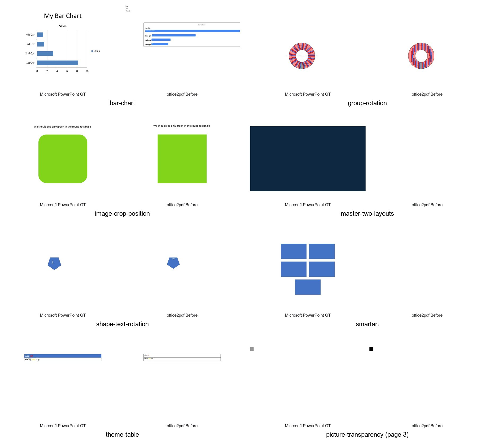

# PPTX visual audit

Microsoft PowerPoint ground truth is shown beside the office2pdf output in the overview.

| Focus | Ground truth | Before |
|---|---|---|
| Chart | [GT](bar-chart/gt.jpg) | [Before](bar-chart/before.jpg) |
| Group transforms | [GT](group-rotation/gt.jpg) | [Before](group-rotation/before.jpg) |
| Image crop | [GT](image-crop-position/gt.jpg) | [Before](image-crop-position/before.jpg) |
| Master and layout | [GT](master-two-layouts/gt.jpg) | [Before](master-two-layouts/before.jpg) |
| Picture transparency, page 3 | [GT](picture-transparency/gt.jpg) | [Before](picture-transparency/before.jpg) |
| Shape text rotation | [GT](shape-text-rotation/gt.jpg) | [Before](shape-text-rotation/before.jpg) |
| SmartArt | [GT](smartart/gt.jpg) | [Before](smartart/before.jpg) |
| Theme table | [GT](theme-table/gt.jpg) | [Before](theme-table/before.jpg) |
