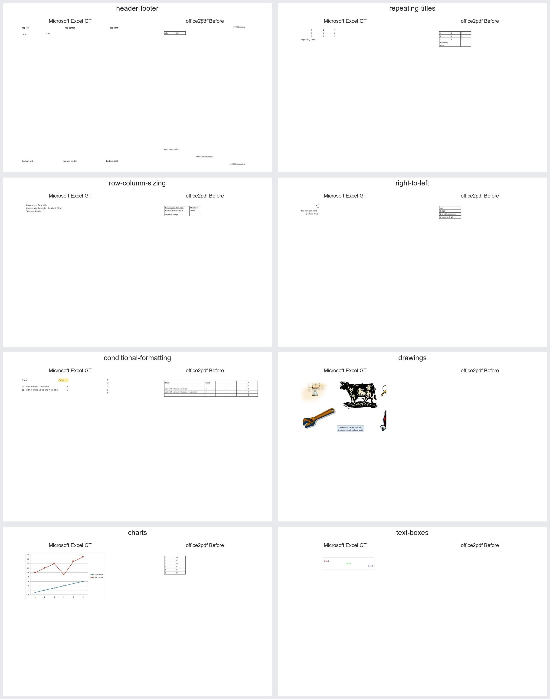

# XLSX visual audit

Microsoft Excel ground truth is shown beside the office2pdf output in the overview.

| Focus | Ground truth | Before | Visual finding |
|---|---|---|---|
| Headers and footers | [GT](header-footer/gt.jpg) | [Before](header-footer/before.jpg) | Placement differs and spurious zero prefixes are rendered. |
| Repeating print titles | [GT](repeating-titles/gt.jpg) | [Before](repeating-titles/before.jpg) | Print-title pagination is not preserved. |
| Row and column sizing | [GT](row-column-sizing/gt.jpg) | [Before](row-column-sizing/before.jpg) | Custom dimensions and whitespace are replaced by a compact bordered table. |
| Right-to-left sheets | [GT](right-to-left/gt.jpg) | [Before](right-to-left/before.jpg) | Sheet direction, placement, number display, and mixed-script order differ. |
| Conditional formatting | [GT](conditional-formatting/gt.jpg) | [Before](conditional-formatting/before.jpg) | The evaluated fill is missing. |
| Drawings | [GT](drawings/gt.jpg) | [Before](drawings/before.jpg) | Worksheet drawings are omitted. |
| Charts | [GT](charts/gt.jpg) | [Before](charts/before.jpg) | The chart is omitted and only its source cells remain. |
| Text boxes | [GT](text-boxes/gt.jpg) | [Before](text-boxes/before.jpg) | The text box is omitted. |

The automated manifest also covers page-scale and number-format fixtures. The
page-scale fixture is visually empty, while the sampled number formats are
largely preserved; neither is treated as a separate confirmed defect here.
